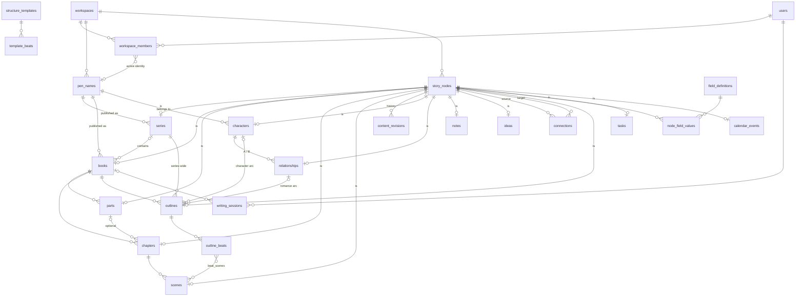

# Database

PostgreSQL 16 with Prisma ORM 7. The schema lives in `prisma/schema.prisma`;
migrations in `prisma/migrations/`.

This document has two parts:

1. **Implemented**: what exists in the database today (Milestones 0–2).
2. **Target design**: the agreed schema for every planned module, including
   the Universal Connection layer. Each milestone implements its slice.
   Changes to the target design are recorded in [DECISIONS.md](DECISIONS.md).

## Conventions

| Rule                             | Detail                                                                                                                                                                                                                                                                                                                                                                                       |
| -------------------------------- | -------------------------------------------------------------------------------------------------------------------------------------------------------------------------------------------------------------------------------------------------------------------------------------------------------------------------------------------------------------------------------------------- |
| Tenancy                          | Every domain table has a `workspace_id`. Services filter by it via `AuthorContext`.                                                                                                                                                                                                                                                                                                          |
| Tenant-safe foreign keys         | A reference to another row in the same workspace is a **composite FK including `workspace_id`** (e.g. `books(pen_name_id, workspace_id) → pen_names(id, workspace_id)`), so the database itself rejects cross-workspace links even if a service check were missed. Optional relations use plain FKs plus service checks (Prisma requires all-or-nothing optionality on composite relations). |
| Story nodes                      | Story objects (series, books, parts, chapters, scenes, and future characters, locations…) take their primary key from a row in `story_nodes`. See [Story Graph](#story-graph).                                                                                                                                                                                                               |
| Primary keys                     | `uuid` with `@default(uuid(7))`: time-ordered (good B-tree locality), not guessable, safe in URLs.                                                                                                                                                                                                                                                                                           |
| Naming                           | Prisma models/fields in PascalCase/camelCase; Postgres tables/columns in snake_case via `@@map`/`@map`.                                                                                                                                                                                                                                                                                      |
| Timestamps                       | `created_at`, `updated_at` on every table that users edit.                                                                                                                                                                                                                                                                                                                                   |
| Soft delete                      | Creative and planning content has `deleted_at` (the Trash). Reads exclude it, and children of a trashed parent are hidden with it. Author identities use `archived_at` instead: archived, never deleted.                                                                                                                                                                                     |
| Ordering                         | Ordered siblings use a fractional-index `position` **text column with `COLLATE "C"`** (byte order, matching the JavaScript comparison). A move updates one row. Not unique: ties (only from concurrent writes) sort by id, and the app re-keys siblings when it meets one.                                                                                                                   |
| Rich text                        | ProseMirror JSON in `jsonb`, plus a server-derived plain-text column used for search and word counts.                                                                                                                                                                                                                                                                                        |
| Enums                            | Postgres enums for small closed sets that code branches on (roles, statuses). Free-form categories are text.                                                                                                                                                                                                                                                                                 |
| Constraints Prisma can't express | Partial unique indexes, CHECK constraints, collations and triggers are hand-added to the generated migration SQL, with a comment in the schema pointing to them. `prisma migrate diff` reports no drift for them.                                                                                                                                                                            |
| Concurrency                      | Writes that depend on current state (versioned saves, appending structure) lock the relevant row (`SELECT … FOR UPDATE`) inside a transaction.                                                                                                                                                                                                                                               |

### Migration workflow

```bash
# edit prisma/schema.prisma, then:
pnpm db:migrate --name <change> --create-only   # generate SQL, don't apply
# hand-edit the SQL if needed (partial indexes, CHECKs, collations, triggers, renames)
pnpm db:migrate                                 # apply + record
pnpm db:generate                                # regenerate the client
```

If `migrate dev` stops for confirmation (e.g. it wants to drop a column you
intend to rename), generate the SQL with
`prisma migrate diff --from-config-datasource --to-schema prisma/schema.prisma --script`
into a new migration folder and edit it. Production and preview deployments
run `prisma migrate deploy` in `vercel-build`. Migrations must be
backward-compatible with the running app (expand, then contract).

---

## 1. Implemented



### Identity and tenancy (Milestone 0)

| Table                                                  | Purpose                                                                            | Notes                                                                                               |
| ------------------------------------------------------ | ---------------------------------------------------------------------------------- | --------------------------------------------------------------------------------------------------- |
| `users`, `accounts`, `sessions`, `verification_tokens` | Auth.js adapter tables.                                                            | Database sessions; magic-link tokens are stored hashed and single-use.                              |
| `workspaces`                                           | Ownership boundary for all author data.                                            | One per user in the MVP.                                                                            |
| `workspace_members`                                    | User ↔ workspace with `role` (`OWNER`/`EDITOR`/`VIEWER`) and `active_pen_name_id`. | The active identity is per member, so collaborators will each have their own. `ON DELETE SET NULL`. |

### Author identities (Milestone 1)

| Table       | Key columns                                                                 | Notes                                                                                                                                                                                                                                                                                                        |
| ----------- | --------------------------------------------------------------------------- | ------------------------------------------------------------------------------------------------------------------------------------------------------------------------------------------------------------------------------------------------------------------------------------------------------------ |
| `pen_names` | `workspace_id`, `name`, `bio`, `is_default`, `language` (M6), `archived_at` | Partial unique index: one default per workspace. CHECK `pen_names_default_not_archived`. `language`: optional BCP 47 code (CHECK `pen_names_language_format`) choosing the search stemmer for that identity. Referenced by series and books with `ON DELETE NO ACTION`: pen names are archived, not deleted. |

### Story graph (Milestone 1)

| Table         | Key columns                                                                                                                                          | Notes                                                                                                                                                                |
| ------------- | ---------------------------------------------------------------------------------------------------------------------------------------------------- | -------------------------------------------------------------------------------------------------------------------------------------------------------------------- |
| `story_nodes` | `id`, `workspace_id`, `kind` (`SERIES`/`BOOK`/`PART`/`CHAPTER`/`SCENE`/`CHARACTER`/`RELATIONSHIP`/`OUTLINE`/`NOTE`/`IDEA`/`TASK`/`EVENT`/`PEN_NAME`) | Unique `(id, workspace_id)` for tenant-safe references. Kinds are defined in the Story Object Registry (`story-graph/kinds.ts`), which also names each kind's table. |

Typed tables use their node id as primary key via the composite FK
`(id, workspace_id) → story_nodes(id, workspace_id) ON DELETE CASCADE`.
Two hand-written triggers per typed table:

- `*_node_kind` (BEFORE INSERT): the node must be of the matching kind.
- `*_delete_node` (AFTER DELETE): deletes the node, including when the row is
  removed by a cascade, so no orphaned nodes remain.

Deleting a node is the one way to permanently delete a story object: the
cascade removes the typed row, its children and their revisions, and the
triggers remove the children's nodes.

### Library and manuscript (Milestone 1)

| Table               | Key columns                                                                                                                                                                              | Notes                                                                                                                                                                                    |
| ------------------- | ---------------------------------------------------------------------------------------------------------------------------------------------------------------------------------------- | ---------------------------------------------------------------------------------------------------------------------------------------------------------------------------------------- |
| `series`            | `pen_name_id`, `title`, `description`, `deleted_at`                                                                                                                                      | Pen name via tenant-safe FK.                                                                                                                                                             |
| `books`             | `pen_name_id`, `series_id?`, `series_position?` (C collation), `title`, `subtitle`, `description`, `writing_status` (M8; was `status`), `target_word_count`, `heat_level?`, `deleted_at` | CHECK: `series_position` set exactly when `series_id` is. Books in a series share the series' pen name (service rule).                                                                   |
| `parts`             | `book_id`, `title`, `position`, `deleted_at`                                                                                                                                             | Optional level. Unique `(id, book_id)` so chapters can reference parts safely.                                                                                                           |
| `chapters`          | `book_id`, `part_id?`, `title`, `position`, `deleted_at`                                                                                                                                 | `part_id` null = book top level, sharing the position space with parts.                                                                                                                  |
| `scenes`            | `book_id`, `chapter_id`, `title`, `position`, `status`, `synopsis`, `content` (jsonb), `content_text`, `word_count`, `version`, `deleted_at`                                             | FK `(chapter_id, book_id) → chapters(id, book_id)`: a scene's book is always its chapter's book. `version` increments on each content save (optimistic concurrency).                     |
| `content_revisions` | `node_id`, `content`, `content_text`, `word_count`, `source` (`AUTOSAVE`/`MANUAL`/`BEFORE_RESTORE`/`AI_ACCEPTED`/`IMPORT`), `label`, `created_by_id`, `created_at`                       | Append-only history of any versioned story object (scenes, notes); renamed from `scene_revisions` in M3. Tenant-safe FK to `story_nodes`, cascade. Indexed `(node_id, created_at DESC)`. |

The **manuscript** is a view, not a table: a book's parts, chapters and
scenes in `position` order. Book and part word totals are computed from
visible scenes, not stored.

### Universal connections (Milestone 2)

Any two story nodes can be linked. One table holds every link:

| Column                                      | Notes                                                                                                                        |
| ------------------------------------------- | ---------------------------------------------------------------------------------------------------------------------------- |
| `id`, `workspace_id`                        |                                                                                                                              |
| `source_id`, `target_id`                    | Composite tenant-safe FKs to `story_nodes (id, workspace_id)`, `ON DELETE CASCADE`: a connection disappears with either end. |
| `kind`                                      | Registry key (`develops_in`, `about`, `inspired`, `concerns`, `related`). CHECK: lowercase identifier.                       |
| `label`, `note`                             | The author's own wording and a short note.                                                                                   |
| `attributes`                                | `jsonb` object (CHECK) holding kind-specific values validated by the registry, e.g. `{ "role": "POV" }`.                     |
| `created_by_id`, `created_at`, `updated_at` |                                                                                                                              |

Constraints and indexes:

- `UNIQUE (source_id, target_id, kind)`. Undirected kinds are stored once
  per pair in id order, so `related` can't be duplicated from the other side.
- CHECK `connections_not_self`: no self-links.
- Kind-specific rules that the database must enforce are added as partial
  indexes. (The former `appears_in` kind and its one-POV index moved to
  `scene_participations` in M11.)
- Indexes on `target_id` (backlinks) and `(workspace_id, kind)`.

What is **not** in the table: which node kinds a kind may join, its wording in
each direction, and its attribute options. Those live in
`src/modules/connections/registry.ts`, so new kinds, and new object types
taking part in existing kinds, need no migration.

Reading: a node's connections are read in both directions and the other end
is resolved per kind (title, context, link). Ends in the Trash (or inside
something in the Trash) are hidden, not deleted, and reappear on restore.

### Story bible (Milestone 2)

| Table                  | Key columns                                                                                                                                                                          | Notes                                                                                                                                                                                                                                                           |
| ---------------------- | ------------------------------------------------------------------------------------------------------------------------------------------------------------------------------------ | --------------------------------------------------------------------------------------------------------------------------------------------------------------------------------------------------------------------------------------------------------------- |
| `characters`           | node id, `pen_name_id`, `series_id?`, `name`, `aliases text[]`, `role` (`PROTAGONIST`/`ANTAGONIST`/`LOVE_INTEREST`/`SUPPORTING`/`MINOR`), `summary`, `profile` (jsonb), `deleted_at` | Every character belongs to one pen name (M3; tenant-safe FK, `NO ACTION`), and optionally to one of its series. Profile fields by id (`modules/characters/profile.ts`). Scene appearances are `scene_participations` (M11). `series_id` → `ON DELETE SET NULL`. |
| `relationships`        | node id, `member_key`, `type`, `description`, `deleted_at`                                                                                                                           | A story node, between **two or more** characters (members below). Unique `(workspace_id, member_key)`: one relationship per exact set of members. Deferred constraint triggers check at commit: at least two members, key = sorted member ids.                  |
| `relationship_members` | PK `(relationship_id, character_id)`, `workspace_id`, `position`, `role` (M6)                                                                                                        | Tenant-safe FKs, cascade. Trigger `characters_delete_relationships`: deleting a character forever deletes every relationship they belong to. Migrated from the M2 pair columns (`character_a_id`, `character_b_id`), data kept.                                 |
| `notes`                | node id, `title`, `body` (jsonb), `body_text`, `version`, `deleted_at`                                                                                                               | What a note is about is a set of `about` connections. `version` for conflict detection, like scenes.                                                                                                                                                            |
| `ideas`                | node id, `title`, `body`, `status` (`OPEN`/`USED`/`ARCHIVED`), `deleted_at`                                                                                                          | Promotion to a book creates the book and an `inspired` connection.                                                                                                                                                                                              |

All four use the story-node triggers (kind check, node cleanup).

### Story structure (Milestones 3–4)

Four separate concepts, never mixed: story objects (nodes), the structural
manuscript (book → part → chapter → scene), **beat assignments** (below), and
universal connections. A scene is never copied: plot, romance, character-arc
and subplot beats all point at the same scene row.

| Table                 | Key columns                                                                                                                                                                                                   | Notes                                                                                                                                                                                                                                                                                                                                                                      |
| --------------------- | ------------------------------------------------------------------------------------------------------------------------------------------------------------------------------------------------------------- | -------------------------------------------------------------------------------------------------------------------------------------------------------------------------------------------------------------------------------------------------------------------------------------------------------------------------------------------------------------------------- |
| `structure_templates` | `workspace_id?`, `kind`, `name`, `description`, `source`, `for_series`, `updated_at`                                                                                                                          | `workspace_id` null = built-in, seeded by the migration with fixed ids (Three-Act, Save the Cat, Hero's Journey, Romancing the Beat, Positive Change Arc). Workspace templates ("Save as template") use the same table, FK to the workspace (cascade). `for_series`: saved from a series structure.                                                                        |
| `template_beats`      | `template_id`, `title`, `description`, `target_percent?`, `book_index?`, `position`                                                                                                                           | CHECK 0–100. `book_index` (1 = first book, CHECK ≥ 1): the book a series template's beat is planned for.                                                                                                                                                                                                                                                                   |
| `outlines`            | node id, `book_id?`, `series_id?`, `kind` (`PLOT`/`ROMANCE`/`CHARACTER_ARC`/`SUBPLOT`/`CUSTOM`), `title`, `template_id?`, `relationship_id?`, `character_id?`, `arc_role?` (`MAIN`/`SECONDARY`), `deleted_at` | A story node (so notes and links attach to it). CHECK `outlines_book_or_series`: exactly one of book and series (a series structure spans its books). CHECK `outlines_owner_matches_kind`: a romance arc has a relationship, a character arc a character, others neither. CHECK: `arc_role` only on romance arcs. Owner and book/series share the pen name (service rule). |
| `outline_beats`       | `outline_id`, `template_beat_id?`, `book_id?`, `title`, `description`, `target_percent?`, `position` (C collation)                                                                                            | Copied from the template on creation: the beats are then the author's own. `book_id` (series structures only, service rule; FK `SET NULL`): the book the beat is planned for.                                                                                                                                                                                              |
| `beat_scenes`         | PK `(beat_id, scene_id)`, `workspace_id`, `created_at`                                                                                                                                                        | **Structural assignment**, many-to-many: a beat may span scenes (and, in a series structure, books), a scene may carry beats of many outlines. Tenant-safe FKs, cascade both ways. The scene must be in the structure's book, or in a book of its series (service rule).                                                                                                   |

### Custom fields (Milestones 3–4)

| Table               | Key columns                                                                                                                      | Notes                                                                                                                                                                                                |
| ------------------- | -------------------------------------------------------------------------------------------------------------------------------- | ---------------------------------------------------------------------------------------------------------------------------------------------------------------------------------------------------- |
| `field_definitions` | `workspace_id`, `node_kind`, `label`, `type` (`TEXT`/`LONG_TEXT`), `position`, scope: `pen_name_id?` / `series_id?` / `book_id?` | Author-defined fields for any node kind. Scope: one pen name (the UI default), one series, one book, or none = all identities; CHECK at most one. Unique per (workspace, kind, scope, lower(label)). |
| `node_field_values` | PK `(node_id, field_id)`, `workspace_id`, `value`                                                                                | Values attach to story nodes, so any object type gains custom fields without a migration. Cascade with the node and the definition.                                                                  |

### Planning and progress (Milestone 4)

| Table                   | Key columns                                                                                                                                                    | Notes                                                                                                                                                                                                                                                                                                                                                                                   |
| ----------------------- | -------------------------------------------------------------------------------------------------------------------------------------------------------------- | --------------------------------------------------------------------------------------------------------------------------------------------------------------------------------------------------------------------------------------------------------------------------------------------------------------------------------------------------------------------------------------- |
| `tasks`                 | node id, `title`, `notes`, `status` (`TODO`/`IN_PROGRESS`/`DONE`), `priority` (`LOW`/`NORMAL`/`HIGH`), `due_on?` (date), `completed_at?`, `deleted_at`         | Story node, author-level (no pen name). What a task is for: `concerns` connections.                                                                                                                                                                                                                                                                                                     |
| `calendar_events`       | node id, `title`, `description`, `starts_on` (date), `ends_on?`, `start_time?` ("HH:MM"), `purpose` (`EVENT`/`DEADLINE`, M7), `subject_id?` (M7), `deleted_at` | Story node; `concerns` connections. The one place dates live (M7): an event of its own, or a date that belongs to `subject_id` (FK to `story_nodes`, cascade; same workspace by trigger `calendar_events_subject_workspace`). CHECK `calendar_events_deadline_has_subject`; partial unique `calendar_events_one_deadline_per_subject`. CHECKs: ends on or after it starts; time format. |
| `writing_sessions`      | `workspace_id`, `user_id`, `book_id?`, `date` (the author's local date), `source` (`EDITOR`/`MANUAL`), `words_added`, `words_removed`, `minutes?`, `note`      | `EDITOR` rows are written by scene saves in the same transaction; partial unique index: one per (user, book, date), upserted atomically. `MANUAL` rows are words the author logs. Net words per day = added − removed. CHECK non-negative. `book_id` → `SET NULL` (stats survive a deleted book).                                                                                       |
| `books` (+)             | ~~`due_on`~~ (removed in M7)                                                                                                                                   | A book's deadline is now its `DEADLINE` calendar entry; existing due dates were migrated.                                                                                                                                                                                                                                                                                               |
| `users` (+)             | `time_zone?`                                                                                                                                                   | IANA zone deciding "today".                                                                                                                                                                                                                                                                                                                                                             |
| `workspace_members` (+) | `daily_word_goal?`                                                                                                                                             | Per member (collaborators each get their own). CHECK > 0.                                                                                                                                                                                                                                                                                                                               |

Date-only columns store UTC midnight; `lib/dates.ts` converts without
drifting a day.

### Template kits and search (Milestone 5)

| Table                | Key columns                                                    | Notes                                                                                                                                                            |
| -------------------- | -------------------------------------------------------------- | ---------------------------------------------------------------------------------------------------------------------------------------------------------------- |
| `template_kits`      | `workspace_id`, `name`, `description`                          | A named set of templates applied together.                                                                                                                       |
| `template_kit_items` | `kit_id`, `item_type` (`STRUCTURE`), `template_id`, `position` | Cascade with the kit and with the template (deleting a template removes it from kits, shown by Change Impact). `item_type` leaves room for other template kinds. |

Search uses expression GIN indexes, `to_tsvector('simple', …)` over
`scenes` (title, synopsis, content_text), `notes` (title, body_text),
`ideas` (title, body) and `characters` (name, aliases via the IMMUTABLE
`search_join(text[])`, summary). Queries repeat the exact expressions.
Stemmed matching in a pen name's language (M6) computes
`to_tsvector('<language>', …)` on the workspace's rows without an index.

`relationship_members.role` (M6): optional, 1–60 characters (CHECK
`relationship_members_role_length`); a role in that relationship, not a
property of the character.

### Import (Milestone 6)

No new tables: the import writes the existing ones in one transaction.
Story-node ids from a backup are inserted as they are (restores) or
replaced by new UUIDv7s (copies). `content_revisions.source = 'IMPORT'`
marks text saved before an import replaced it.

### Foundations (Milestone 7)

- **Pen names are story nodes.** `pen_names.id` is a node id (composite FK
  `(id, workspace_id)` → `story_nodes`, cascade), with the two node
  triggers. Existing pen names got their nodes in the migration (same ids).
  New pen names get their id from `createStoryNode()`.
- **Dates in one place.** `calendar_events.purpose` and `subject_id`;
  `books.due_on` moved into `DEADLINE` entries and was dropped.
- **`uuidv7()` SQL function** for data migrations (Postgres 16 has no
  built-in UUIDv7).
- Migrations: `20261009090000_pen_name_node_kind` (adds the enum value on
  its own: it must be committed before use), `20261009090100_foundations`.

### Tropes (Milestone 13)

- **`tropes`** (node kind `TROPE`, with the two story-node triggers):
  `workspace_id`, `name` (CHECK: not blank, ≤ 200), `description`,
  `deleted_at`, timestamps. Shared: no pen name. Partial unique index
  `tropes_unique_live_name` on (`workspace_id`, `lower(btrim(name))`)
  where `deleted_at IS NULL`.
- Links are `connections` of kind `uses_trope` (book, series,
  relationship or structure → trope); there is no trope link table.
- Migrations `20261014090000_trope_node_kind` (the enum value, on its own)
  and `20261014090100_tropes`: every non-blank `books.tropes` value,
  trimmed, became one trope per workspace and name ignoring case (named by
  the most used spelling; ties by byte order), each book linked to its
  tropes; then `books.tropes` was dropped. Export format 6.

### Story Time (Milestone 12)

- **`scene_story_times`**: `scene_id` (primary key; tenant-safe FK to
  `scenes`, cascade), `workspace_id`, `position` (text `COLLATE "C"`,
  fractional), `label` (free text ≤ 200, never a date), `created_by_id`,
  timestamps. One point per scene; no row = not placed yet.
- **`timeline_events`** (node kind `TIMELINE_EVENT`, with the two
  story-node triggers): `book_id?` / `series_id?` (CHECK: exactly one;
  tenant-safe FKs, cascade), `title`, `description`, `label`, `position`,
  `deleted_at`, timestamps.
- The timeline of a scene or book event is its book's series if any, else
  the book: derived, not stored. Positions of a timeline's scenes and
  events share one ordering space.
- History: changes to a scene's story time are kept in `field_revisions`
  (field `storyTime`); event descriptions have field history.
- Migrations `20261013090000_timeline_event_node_kind` (the enum value, on
  its own) and `20261013090100_story_time`. Export format 5.

### Scene Participation (Milestone 11)

| Column                                      | Notes                                                                                                        |
| ------------------------------------------- | ------------------------------------------------------------------------------------------------------------ |
| `workspace_id`, `scene_id`, `character_id`  | Primary key (`scene_id`, `character_id`). Tenant-safe FKs to `scenes` and `characters`, `ON DELETE CASCADE`. |
| `presence`                                  | `scene_presence` enum: `PRESENT`, `MENTIONED`.                                                               |
| `is_pov`                                    | The scene is told from this character. Partial unique index `scene_participations_one_pov` (one per scene).  |
| `created_by_id`, `created_at`, `updated_at` |                                                                                                              |

- Index on `character_id` (a character's scenes). Same pen name and series
  rules as before, enforced by the service and checked by the audit.
- History: changes are kept in `field_revisions` on the scene (field
  `participation:<character id>`, value `{ "from", "to" }`).
- Migration `20261012090000_scene_participation`: created the table, moved
  every `appears_in` connection across (POV → point of view and present;
  Present; Mentioned) with its dates and author, then removed those
  connections and the old index. Export format 4.

### Work Context (Milestone 10)

- **`workspace_members.writing_scene_id`** (FK → `scenes`, `ON DELETE SET
NULL`), **`writing_anchor`** (jsonb: version, position, surrounding text,
  scroll) and **`writing_at`**: the member's latest writing place for
  Continue Writing. Working state, not story data: not exported, read
  through the Story Graph funnel, never used to authorize. Return to Work
  lives in the browser tab, not the database.
- Migration: `20261011090000_work_context`.

### Safety and readiness (Milestone 8)

- **`books.writing_status`** (`writing_status` enum: `IDEA`, `PLANNING`,
  `DRAFTING`, `DRAFTED`, `REVISING`, `EDITING`, `PROOFREADING`, `COMPLETE`)
  replaced `books.status` / `book_status`. Writing status never says
  "Published": books that were `PUBLISHED` became `COMPLETE`, and the fact
  was kept as a book field "Publication status" = "Published", so no
  information was lost. **Temporary compatibility architecture:** this
  field is a stopgap until Edition/Publishing replaces it (migrated, then
  removed); nothing new builds on it. Publication belongs to editions
  (v1.1). `books.tropes text[]` was the other stopgap: migrated into Trope
  objects and dropped in M13.
- **`field_revisions`**: `workspace_id`, `node_id` (composite FK →
  `story_nodes`, cascade), `field` (a column such as `synopsis`, a profile
  field `profile.<key>`, or `beat:<id>.description` on an outline; CHECK
  1–200 chars), `value`, `source` (`revision_source`), `created_by_id?`,
  `created_at`. Index `(node_id, field, created_at DESC)`. Earlier values of
  long-form text that isn't a rich-text document.
- **Document format versions:** `scenes.content_format`,
  `notes.body_format`, `content_revisions.content_format` (int, default 1).
  Documents are upgraded when read (`lib/doc-format.ts`); a document newer
  than the app understands is refused on import, never misread.
- **`revision_source`** gains `BEFORE_LARGE_EDIT` (checkpoint before a save
  that removes much of a document) and `BEFORE_EDIT` (field history).
- Migration: `20261010090000_safety_and_readiness`. Data migrations run
  statement by statement: don't rely on `ON COMMIT DROP` temporary tables.

### Retention

Nothing is pruned automatically:

- **History.** `content_revisions` and `field_revisions` rows are kept
  indefinitely, whatever their source: autosave and large-edit checkpoints,
  named versions, earlier field values, before-restore copies, imports, and
  future publication snapshots.
- **Trash** keeps items until the author deletes them forever or empties it.
- **Archive** (pen names; ideas' `ARCHIVED` status) hides without deleting.

These are three distinct concepts: the Trash is deletion that can be undone,
the archive is "not now", and history is earlier versions of live content.

---

## 2. Target design

### Next: object types that join the graph

Every new object type gets a node kind, a typed table using the node id, the
two triggers, and a case in the resolver; it can then take part in
connections. Outlines joined in M3, tasks and events in M4. Planned: timeline
events (v1.1), and later locations, research items, songs, plot threads and
worldbuilding entries. New connection kinds join the registry as needed
(e.g. `set_in` for Scene → Location,
`soundtrack` for Scene → Song).

| Table               | Notes                                                                                  |
| ------------------- | -------------------------------------------------------------------------------------- |
| `tags`, `node_tags` | `node_tags(node_id, tag_id)`: tags attach to story nodes, so they work for every type. |

### Later: scopes for notes and ideas

Notes and ideas are author-level and shared across pen names. An optional
scope would add nullable `pen_name_id`, `series_id`, `book_id` (CHECK at
most one) to `notes` and `ideas`; capture stays scope-free. The resolver
derives each object's identity per kind, so identity rules would apply to
scoped notes without other changes.

### Later: template kits and group relationships

- `template_kits(workspace_id, name)` + `template_kit_items(kit_id,
template_id, position)`: apply a main plot, romance and character arcs
  together; each still creates its own new structure.
- `relationship_members(relationship_id, character_id)` for relationships
  of more than two characters; the Romance Center already groups arcs by
  relationship.

### Later: import and export jobs

- JSON import shipped in M6 (synchronous, one transaction).
- An `import_jobs` / `exports` table when imports and exports run as
  background jobs (v1.1), with the uploaded file in object storage.

### v1.1: publishing (the timeline was built in M12)

| Table                                      | Key columns                                                   | Notes                                                                                                                                                                                                                                       |
| ------------------------------------------ | ------------------------------------------------------------- | ------------------------------------------------------------------------------------------------------------------------------------------------------------------------------------------------------------------------------------------- |
| `publishing_workflows`, `publishing_steps` | `book_id`; `stage`, `status`, `due_at?`, `position`           | From a default checklist.                                                                                                                                                                                                                   |
| `editions`                                 | `book_id`, `pen_name_id?`, `format`, `isbn?`, `release_date?` | **The extension point for a book-level publication identity.** A book's pen name follows its series; an edition may be published under a different identity via `pen_name_id`. Built with Publishing (v1.1); nothing earlier depends on it. |
| `retail_listings`                          | `edition_id`, `retailer`, `url`, `asin?`                      |                                                                                                                                                                                                                                             |
| `pen_names` (+)                            | `pen_name_links` (website, socials), brand kit                | Pen-name branding and publishing accounts.                                                                                                                                                                                                  |

### Decided shapes for later systems (M8)

Recorded so nothing built now blocks them (decisions 87–92, 106):

| Future table(s)                                | Shape                                                                                                                                                                                                                                     |
| ---------------------------------------------- | ----------------------------------------------------------------------------------------------------------------------------------------------------------------------------------------------------------------------------------------- |
| `editions`, `edition_status`                   | Book → Edition (ebook, paperback, hardcover, audiobook) → publishing status per edition ("Ebook: Published", "Audiobook: Not started"). `books.writing_status` stays about the writing.                                                   |
| `beats` (node kind `BEAT`), `beat_assignments` | The beat (name, description, purpose, target position, required, structure, template source) separate from where it happens (assignment: structure/arc → book → scene). One scene can satisfy beats of several structures without copies. |
| `comments`, `comment_anchors`                  | Comments are metadata, never in the text: anchor = node, document version, position, quoted text and surrounding context. When the text changes, the anchor is re-found or the comment is flagged for review, never silently moved.       |
| `project_access` (or `book_grants`)            | Workspace membership ≠ access to every book: per-book/series/pen-name grants for co-authors and editors. Private projects, pen names and business records stay isolated.                                                                  |
| Life Planner (separate boundary)               | Its own tables and permissions; shares only explicit task/event references (`shared_items` with a grant). No reads of AuthorOS story data; no personal/household data inside AuthorOS. Enforced in services and schema, not the UI.       |

### v1.2: AI suggestions

| Table         | Key columns                                                                                                                                                                                          | Notes                                                                                                                      |
| ------------- | ---------------------------------------------------------------------------------------------------------------------------------------------------------------------------------------------------- | -------------------------------------------------------------------------------------------------------------------------- |
| `suggestions` | `workspace_id`, `node_id`, `kind`, `payload` (jsonb), `status` (`PENDING`/`ACCEPTED`/`REJECTED`/`STALE`), `model`, `prompt_version`, `base_revision_id?`, `created_by`, `resolved_at`, `resolved_by` | Targets a story node (tenant-safe FK; no longer polymorphic). `STALE` if the target changed after the suggestion was made. |

### Later: collaboration

Add rows to `workspace_members` (EDITOR/VIEWER), a `workspace_invitations`
table, and `created_by`/`updated_by` on content tables. An `activity_log`
keyed by `node_id` gives per-object history.
