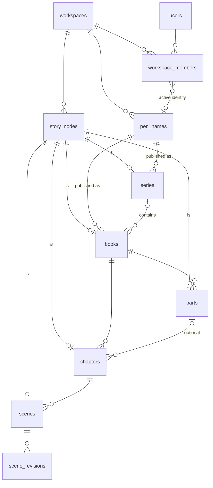

# Database

PostgreSQL 16 with Prisma ORM 7. The schema lives in `prisma/schema.prisma`;
migrations in `prisma/migrations/`.

This document has two parts:

1. **Implemented**: what exists in the database today (Milestones 0–1).
2. **Target design**: the agreed schema for every planned module, including
   the Universal Connection layer. Each milestone implements its slice.
   Changes to the target design are recorded in [DECISIONS.md](DECISIONS.md).

## Conventions

| Rule                             | Detail                                                                                                                                                                                                                                                                                                                                                                                       |
| -------------------------------- | -------------------------------------------------------------------------------------------------------------------------------------------------------------------------------------------------------------------------------------------------------------------------------------------------------------------------------------------------------------------------------------------- |
| Tenancy                          | Every domain table has a `workspace_id`. Services filter by it via `AuthorContext`.                                                                                                                                                                                                                                                                                                          |
| Tenant-safe foreign keys         | A reference to another row in the same workspace is a **composite FK including `workspace_id`** (e.g. `books(pen_name_id, workspace_id) → pen_names(id, workspace_id)`), so the database itself rejects cross-workspace links even if a service check were missed. Optional relations use plain FKs plus service checks (Prisma requires all-or-nothing optionality on composite relations). |
| Story nodes                      | Story objects (series, books, parts, chapters, scenes, and future characters, locations…) take their primary key from a row in `story_nodes`. See [Story Graph](#story-graph).                                                                                                                                                                                                               |
| Primary keys                     | `uuid` with `@default(uuid(7))`: time-ordered (good B-tree locality), not guessable, safe in URLs.                                                                                                                                                                                                                                                                                           |
| Naming                           | Prisma models/fields in PascalCase/camelCase; Postgres tables/columns in snake_case via `@@map`/`@map`.                                                                                                                                                                                                                                                                                      |
| Timestamps                       | `created_at`, `updated_at` on every table that users edit.                                                                                                                                                                                                                                                                                                                                   |
| Soft delete                      | Creative and planning content has `deleted_at` (the Trash). Reads exclude it, and children of a trashed parent are hidden with it. Author identities use `archived_at` instead: archived, never deleted.                                                                                                                                                                                     |
| Ordering                         | Ordered siblings use a fractional-index `position` **text column with `COLLATE "C"`** (byte order, matching the JavaScript comparison). A move updates one row. Not unique: ties (only from concurrent writes) sort by id, and the app re-keys siblings when it meets one.                                                                                                                   |
| Rich text                        | ProseMirror JSON in `jsonb`, plus a server-derived plain-text column used for search and word counts.                                                                                                                                                                                                                                                                                        |
| Enums                            | Postgres enums for small closed sets that code branches on (roles, statuses). Free-form categories are text.                                                                                                                                                                                                                                                                                 |
| Constraints Prisma can't express | Partial unique indexes, CHECK constraints, collations and triggers are hand-added to the generated migration SQL, with a comment in the schema pointing to them. `prisma migrate diff` reports no drift for them.                                                                                                                                                                            |
| Concurrency                      | Writes that depend on current state (versioned saves, appending structure) lock the relevant row (`SELECT … FOR UPDATE`) inside a transaction.                                                                                                                                                                                                                                               |

### Migration workflow

```bash
# edit prisma/schema.prisma, then:
pnpm db:migrate --name <change> --create-only   # generate SQL, don't apply
# hand-edit the SQL if needed (partial indexes, CHECKs, collations, triggers, renames)
pnpm db:migrate                                 # apply + record
pnpm db:generate                                # regenerate the client
```

If `migrate dev` stops for confirmation (e.g. it wants to drop a column you
intend to rename), generate the SQL with
`prisma migrate diff --from-config-datasource --to-schema prisma/schema.prisma --script`
into a new migration folder and edit it. Production and preview deployments
run `prisma migrate deploy` in `vercel-build`. Migrations must be
backward-compatible with the running app (expand, then contract).

---

## 1. Implemented



### Identity and tenancy (Milestone 0)

| Table                                                  | Purpose                                                                            | Notes                                                                                               |
| ------------------------------------------------------ | ---------------------------------------------------------------------------------- | --------------------------------------------------------------------------------------------------- |
| `users`, `accounts`, `sessions`, `verification_tokens` | Auth.js adapter tables.                                                            | Database sessions; magic-link tokens are stored hashed and single-use.                              |
| `workspaces`                                           | Ownership boundary for all author data.                                            | One per user in the MVP.                                                                            |
| `workspace_members`                                    | User ↔ workspace with `role` (`OWNER`/`EDITOR`/`VIEWER`) and `active_pen_name_id`. | The active identity is per member, so collaborators will each have their own. `ON DELETE SET NULL`. |

### Author identities (Milestone 1)

| Table       | Key columns                                                | Notes                                                                                                                                                                                    |
| ----------- | ---------------------------------------------------------- | ---------------------------------------------------------------------------------------------------------------------------------------------------------------------------------------- |
| `pen_names` | `workspace_id`, `name`, `bio`, `is_default`, `archived_at` | Partial unique index: one default per workspace. CHECK `pen_names_default_not_archived`. Referenced by series and books with `ON DELETE NO ACTION`: pen names are archived, not deleted. |

### Story graph (Milestone 1)

| Table         | Key columns                                                             | Notes                                                   |
| ------------- | ----------------------------------------------------------------------- | ------------------------------------------------------- |
| `story_nodes` | `id`, `workspace_id`, `kind` (`SERIES`/`BOOK`/`PART`/`CHAPTER`/`SCENE`) | Unique `(id, workspace_id)` for tenant-safe references. |

Typed tables use their node id as primary key via the composite FK
`(id, workspace_id) → story_nodes(id, workspace_id) ON DELETE CASCADE`.
Two hand-written triggers per typed table:

- `*_node_kind` (BEFORE INSERT): the node must be of the matching kind.
- `*_delete_node` (AFTER DELETE): deletes the node, including when the row is
  removed by a cascade, so no orphaned nodes remain.

Deleting a node is the one way to permanently delete a story object: the
cascade removes the typed row, its children and their revisions, and the
triggers remove the children's nodes.

### Library and manuscript (Milestone 1)

| Table             | Key columns                                                                                                                                                         | Notes                                                                                                                                                                |
| ----------------- | ------------------------------------------------------------------------------------------------------------------------------------------------------------------- | -------------------------------------------------------------------------------------------------------------------------------------------------------------------- |
| `series`          | `pen_name_id`, `title`, `description`, `deleted_at`                                                                                                                 | Pen name via tenant-safe FK.                                                                                                                                         |
| `books`           | `pen_name_id`, `series_id?`, `series_position?` (C collation), `title`, `subtitle`, `description`, `status`, `target_word_count`, `deleted_at`                      | CHECK: `series_position` set exactly when `series_id` is. Books in a series share the series' pen name (service rule).                                               |
| `parts`           | `book_id`, `title`, `position`, `deleted_at`                                                                                                                        | Optional level. Unique `(id, book_id)` so chapters can reference parts safely.                                                                                       |
| `chapters`        | `book_id`, `part_id?`, `title`, `position`, `deleted_at`                                                                                                            | `part_id` null = book top level, sharing the position space with parts.                                                                                              |
| `scenes`          | `book_id`, `chapter_id`, `title`, `position`, `status`, `synopsis`, `content` (jsonb), `content_text`, `word_count`, `version`, `deleted_at`                        | FK `(chapter_id, book_id) → chapters(id, book_id)`: a scene's book is always its chapter's book. `version` increments on each content save (optimistic concurrency). |
| `scene_revisions` | `scene_id`, `content`, `content_text`, `word_count`, `source` (`AUTOSAVE`/`MANUAL`/`BEFORE_RESTORE`/`AI_ACCEPTED`/`IMPORT`), `label`, `created_by_id`, `created_at` | Append-only. Indexed `(scene_id, created_at DESC)`.                                                                                                                  |

The **manuscript** is a view, not a table: a book's parts, chapters and
scenes in `position` order. Book and part word totals are computed from
visible scenes, not stored.

---

## 2. Target design

### Universal connections (target design)

The long-term Story Graph lets any object connect to any other: Character →
Inspiration, Scene → Song, Research → Scene, Plot Thread → Scene, Character →
Location, Idea → Book, Note → Romance Arc, Worldbuilding → Scene.

```
connections
  id                uuid PK
  workspace_id      uuid
  source_node_id    uuid  ─┐ composite FKs (node_id, workspace_id)
  target_node_id    uuid  ─┘ → story_nodes, ON DELETE CASCADE
  kind              text          -- "inspired_by", "appears_in", "set_in", "soundtrack"…
  label             text?         -- the author's own wording
  note              text?
  position          text? (C)     -- optional ordering (e.g. a playlist)
  created_by_id     uuid?
  created_at        timestamptz
  UNIQUE (source_node_id, target_node_id, kind)
  INDEX (target_node_id)          -- backlinks: "what points at this scene?"
```

- **No new join table per pair of types.** Any two node kinds can connect.
  Allowed combinations and their wording ("appears in" / "features")
  live in a code registry, so they can grow without migrations.
- **Every new object type joins the graph by getting a node**: characters,
  locations, ideas, notes, research items, songs, plot threads, romance arcs,
  worldbuilding entries. The node-kind enum grows with each one.
- Connections are deleted with either endpoint (cascade). Trashing an endpoint
  hides its connections (the reader filters on the endpoint's `deleted_at`).
- AI may _suggest_ connections later (as `suggestions` rows); only the author
  creates them.
- **Explicit FKs stay for structure and ownership** (scene → chapter, book →
  pen name, character → series scope), where the relationship is fixed, typed
  and needs cascades and integrity. Connections are for the author's
  associative links.

### Milestone 2: story bible

| Table                 | Key columns                                                                                            | Notes                                                                                                                                                               |
| --------------------- | ------------------------------------------------------------------------------------------------------ | ------------------------------------------------------------------------------------------------------------------------------------------------------------------- |
| `ideas`               | node id, `title`, `body` (jsonb), `status` (`OPEN`/`PROMOTED`/`ARCHIVED`)                              | Story node. Promotion to a book/series is recorded as a connection (`promoted_to`).                                                                                 |
| `characters`          | node id, `series_id?`, `name`, `aliases text[]`, `role`, `summary`, `attributes` (jsonb), `deleted_at` | Story node. `attributes` holds flexible profile fields; anything queried gets a real column.                                                                        |
| `scene_characters`    | PK `(scene_id, character_id)`, `presence` (`POV`/`PRESENT`/`MENTIONED`)                                | Structural and queried constantly ("who is in this scene?"), so it stays an explicit table rather than a generic connection.                                        |
| `relationships`       | node id, `character_a_id`, `character_b_id`, `type`, `description`                                     | Story node (so notes, songs, arcs can connect to a relationship). CHECK `character_a_id < character_b_id` + unique pair.                                            |
| `relationship_events` | `relationship_id`, `scene_id?`, `description`, `intensity?`                                            | How the relationship develops scene by scene.                                                                                                                       |
| `notes`               | node id, `title`, `body` (jsonb), `body_text`, `deleted_at`                                            | Story node. Attaching a note to a book, scene, character or romance arc is a **connection** (`about`). This supersedes the exclusive-arc FK design (DECISIONS #22). |
| `tags`, `node_tags`   | `tags(workspace_id, name)`; `node_tags(node_id, tag_id)`                                               | Tags attach to story nodes, so they work for every type.                                                                                                            |

### Milestone 3: story structure and romance

| Table                 | Key columns                                                                                 | Notes                                                                                                                              |
| --------------------- | ------------------------------------------------------------------------------------------- | ---------------------------------------------------------------------------------------------------------------------------------- |
| `structure_templates` | `workspace_id?`, `kind` (`PLOT`/`ROMANCE`/`CUSTOM`), `name`, `description`                  | `workspace_id` null = built-in (seeded).                                                                                           |
| `template_beats`      | `template_id`, `name`, `description`, `position`, `target_percent?`                         |                                                                                                                                    |
| `outlines`            | node id, `book_id`, `template_id?`, `kind`, `relationship_id?`                              | Story node: a romance arc _is_ an outline with `kind = ROMANCE` and a relationship, so "Note → Romance Arc" is a plain connection. |
| `outline_beats`       | `outline_id`, `template_beat_id?`, `title`, `notes`, `position`, `chapter_id?`, `scene_id?` | Beats map to where they happen in the manuscript.                                                                                  |
| `books` (+columns)    | `tropes text[]`, `heat_level?`                                                              |                                                                                                                                    |

### Milestone 4: tasks, calendar, progress

| Table              | Key columns                                                                           | Notes                                                                               |
| ------------------ | ------------------------------------------------------------------------------------- | ----------------------------------------------------------------------------------- |
| `tasks`            | `workspace_id`, `title`, `status`, `priority`, `due_at?`, `completed_at?`, `node_id?` | Optional link to any story node (task about a scene, a character…), tenant-safe FK. |
| `calendar_events`  | `workspace_id`, `title`, `starts_at`, `ends_at?`, `all_day`, `node_id?`               | The calendar merges events, task due dates and (v1.1) publishing deadlines.         |
| `writing_sessions` | `workspace_id`, `user_id`, `book_id?`, `date`, `words_written`, `minutes?`            |                                                                                     |
| `writing_goals`    | `workspace_id`, `book_id?`, `kind`, `target`, `period`                                |                                                                                     |

### Milestone 5: search and export

- Full-text search: generated `tsvector` columns + GIN indexes on scenes,
  notes, ideas and characters. `story_nodes` makes results uniformly
  addressable.
- Export: files generated on demand; an `exports` table arrives with jobs.

### v1.1: timeline and publishing

| Table                                      | Key columns                                                                                             | Notes                                                            |
| ------------------------------------------ | ------------------------------------------------------------------------------------------------------- | ---------------------------------------------------------------- |
| `timeline_events`                          | node id, `book_id?`, `series_id?`, `title`, `story_time_label`, `story_sort_key` (numeric), `scene_id?` | In-world time as a label plus a sortable key (custom calendars). |
| `publishing_workflows`, `publishing_steps` | `book_id`; `stage`, `status`, `due_at?`, `position`                                                     | From a default checklist.                                        |
| `editions`                                 | `book_id`, `pen_name_id?`, `format`, `isbn?`, `release_date?`                                           | `pen_name_id` overrides the book's (e.g. a co-written edition).  |
| `retail_listings`                          | `edition_id`, `retailer`, `url`, `asin?`                                                                |                                                                  |
| `pen_names` (+)                            | `pen_name_links` (website, socials), brand kit                                                          | Pen-name branding and publishing accounts.                       |

### v1.2: AI suggestions

| Table         | Key columns                                                                                                                                                                                          | Notes                                                                                                                      |
| ------------- | ---------------------------------------------------------------------------------------------------------------------------------------------------------------------------------------------------- | -------------------------------------------------------------------------------------------------------------------------- |
| `suggestions` | `workspace_id`, `node_id`, `kind`, `payload` (jsonb), `status` (`PENDING`/`ACCEPTED`/`REJECTED`/`STALE`), `model`, `prompt_version`, `base_revision_id?`, `created_by`, `resolved_at`, `resolved_by` | Targets a story node (tenant-safe FK; no longer polymorphic). `STALE` if the target changed after the suggestion was made. |

### Later: collaboration

Add rows to `workspace_members` (EDITOR/VIEWER), a `workspace_invitations`
table, and `created_by`/`updated_by` on content tables. An `activity_log`
keyed by `node_id` gives per-object history.
