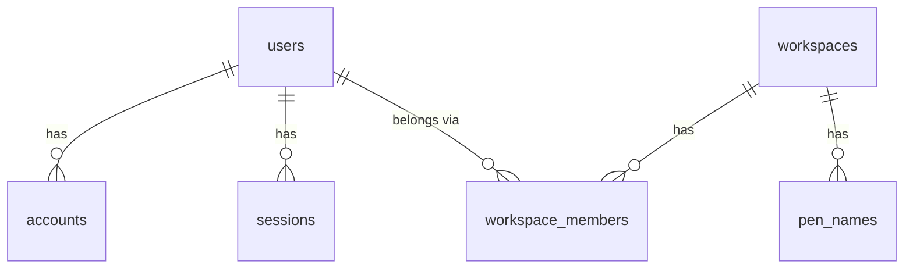
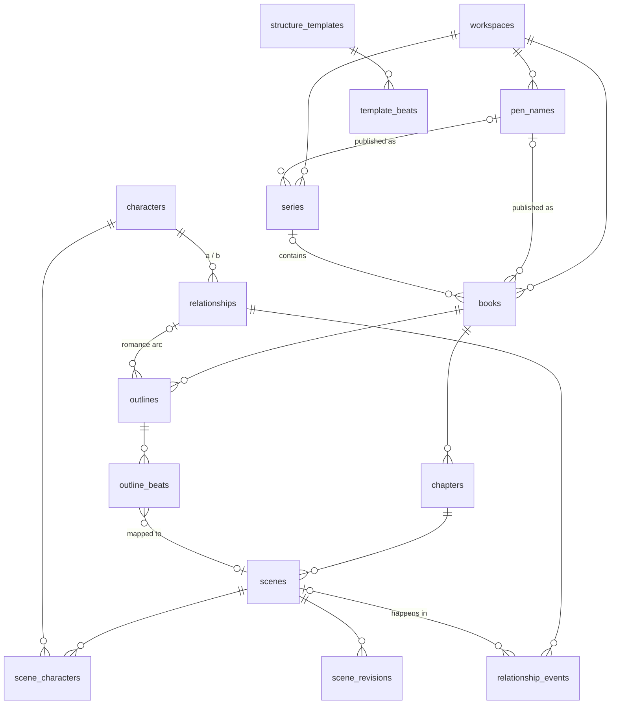

# Database

PostgreSQL 16 with Prisma ORM 7. The schema lives in `prisma/schema.prisma`;
migrations in `prisma/migrations/`.

This document has two parts:

1. **Implemented**: what exists in the database today.
2. **Target design**: the agreed schema for every planned module. Each
   milestone implements its slice of it. Changes to the target design are
   recorded in [DECISIONS.md](DECISIONS.md).

## Conventions

| Rule                             | Detail                                                                                                                                                                                             |
| -------------------------------- | -------------------------------------------------------------------------------------------------------------------------------------------------------------------------------------------------- |
| Tenancy                          | Every domain table has a `workspace_id` (FK, indexed). Services filter by it via `AuthorContext`. Child tables (e.g. scenes) also carry `workspace_id` so any row can be authorized without joins. |
| Primary keys                     | `uuid` with `@default(uuid(7))`: time-ordered (good B-tree locality), not guessable, safe in URLs. Auth.js tables use the same type.                                                               |
| Naming                           | Prisma models/fields in PascalCase/camelCase; Postgres tables/columns in snake_case via `@@map`/`@map`, so raw SQL (search, reports) reads naturally.                                              |
| Timestamps                       | `created_at`, `updated_at` on every table that users edit.                                                                                                                                         |
| Soft delete                      | Creative and planning content has `deleted_at`. Reads exclude it; a Trash view restores it. A background job hard-deletes after a retention period (_planned_).                                    |
| Ordering                         | Ordered siblings (chapters, scenes, beats) use a fractional-index `position` text column, so a move updates one row. Unique per parent.                                                            |
| Rich text                        | ProseMirror JSON in `jsonb`, plus a derived plain-text column used for search and word counts.                                                                                                     |
| Enums                            | Postgres enums for small closed sets that code branches on (roles, statuses). Free-form categories are text.                                                                                       |
| Constraints Prisma can't express | Partial unique indexes, CHECK constraints and full-text indexes are hand-added to the generated migration SQL, with a comment in the schema pointing to it.                                        |
| Deletion cascade                 | Workspace → everything (cascade). Within a workspace, structural parents cascade to children (book → chapters → scenes). Cross-links (e.g. scene ↔ character) cascade only the link row.           |

### Migration workflow

```bash
# edit prisma/schema.prisma, then:
pnpm db:migrate --name <change> --create-only   # generate SQL, don't apply
# hand-edit the SQL if needed (partial indexes, CHECKs, data backfills)
pnpm db:migrate                                 # apply + record
pnpm db:generate                                # regenerate the client
```

Production and preview deployments run `prisma migrate deploy` in `vercel-build`.
Migrations must be backward-compatible with the running version of the app
(expand, then contract) because deployments are not instantaneous.

---

## 1. Implemented (Milestone 0)



| Table                 | Purpose                                                     | Notes                                                                                              |
| --------------------- | ----------------------------------------------------------- | -------------------------------------------------------------------------------------------------- |
| `users`               | A person who signs in.                                      | `email` unique. Created by the Auth.js adapter.                                                    |
| `accounts`            | Linked OAuth accounts (Google).                             | PK `(provider, provider_account_id)`. Token columns keep Auth.js names.                            |
| `sessions`            | Database sessions.                                          | Revocable; indexed by `user_id`.                                                                   |
| `verification_tokens` | Magic-link tokens (stored hashed by Auth.js).               | Single-use; deleted when consumed.                                                                 |
| `workspaces`          | Ownership boundary for all author data.                     | One per user in the MVP.                                                                           |
| `workspace_members`   | User ↔ workspace with a `role` (`OWNER`/`EDITOR`/`VIEWER`). | PK `(workspace_id, user_id)`.                                                                      |
| `pen_names`           | Author identities the workspace publishes under.            | Partial unique index `pen_names_one_default_per_workspace`: at most one live default. Soft delete. |

---

## 2. Target design

### Overview



### Milestone 1: writing loop

| Table             | Key columns                                                                                                                                                                                          | Notes                                                                                                                                                  |
| ----------------- | ---------------------------------------------------------------------------------------------------------------------------------------------------------------------------------------------------- | ------------------------------------------------------------------------------------------------------------------------------------------------------ |
| `series`          | `workspace_id`, `pen_name_id?`, `title`, `description`, `position`                                                                                                                                   | Optional pen name; books inherit it unless they override.                                                                                              |
| `books`           | `workspace_id`, `series_id?`, `pen_name_id?`, `series_position?`, `title`, `subtitle`, `status` (`IDEA`/`PLANNING`/`DRAFTING`/`REVISING`/`COMPLETE`/`PUBLISHED`), `target_word_count?`, `deleted_at` | Standalone books have `series_id` null. Unique `(series_id, series_position)`.                                                                         |
| `chapters`        | `workspace_id`, `book_id`, `title`, `position`, `deleted_at`                                                                                                                                         | Unique `(book_id, position)`. A later "parts" level can be added as an optional parent without breaking this.                                          |
| `scenes`          | `workspace_id`, `book_id`, `chapter_id`, `title`, `position`, `status`, `synopsis`, `content` (jsonb), `content_text`, `word_count`, `pov_character_id?` (M2), `deleted_at`                          | `book_id` is denormalized for whole-book queries (manuscript, word totals). Unique `(chapter_id, position)`. GIN index on `to_tsvector(content_text)`. |
| `scene_revisions` | `scene_id`, `content`, `word_count`, `source` (`USER`/`AI_ACCEPTED`/`IMPORT`/`RESTORE`), `created_by`, `created_at`                                                                                  | Append-only.                                                                                                                                           |

The **manuscript** is a view, not a table: a book's chapters and scenes in
`position` order. Compiled exports are files, not rows.

### Milestone 2: story bible

| Table                 | Key columns                                                                                                                              | Notes                                                                                                                                                            |
| --------------------- | ---------------------------------------------------------------------------------------------------------------------------------------- | ---------------------------------------------------------------------------------------------------------------------------------------------------------------- |
| `ideas`               | `workspace_id`, `title`, `body` (jsonb), `status` (`OPEN`/`PROMOTED`/`ARCHIVED`), `promoted_book_id?`, `promoted_series_id?`             | Promotion keeps a link back to where it went.                                                                                                                    |
| `characters`          | `workspace_id`, `series_id?`, `name`, `aliases text[]`, `role`, `summary`, `attributes` (jsonb), `deleted_at`                            | Characters live in the workspace and can be scoped to a series. `attributes` holds flexible profile fields; anything the app queries on gets a real column.      |
| `scene_characters`    | PK `(scene_id, character_id)`, `presence` (`POV`/`PRESENT`/`MENTIONED`)                                                                  | Answers "where does this character appear?"                                                                                                                      |
| `relationships`       | `workspace_id`, `character_a_id`, `character_b_id`, `type`, `description`                                                                | CHECK `character_a_id < character_b_id` + unique pair: no duplicate or mirrored rows.                                                                            |
| `relationship_events` | `relationship_id`, `scene_id?`, `description`, `intensity?`                                                                              | How the relationship develops scene by scene; feeds romance planning.                                                                                            |
| `notes`               | `workspace_id`, `title`, `body` (jsonb), `body_text`, plus nullable FKs `book_id`, `chapter_id`, `scene_id`, `character_id`, `series_id` | **Exclusive arc**: CHECK `num_nonnulls(...) <= 1` (zero = a workspace-level note). Real FKs keep integrity and cascades, unlike a polymorphic `(type, id)` pair. |
| `tags`, `*_tags`      | `tags(workspace_id, name)`; join tables per taggable entity                                                                              | Added when the first module needs tags.                                                                                                                          |

### Milestone 3: story structure and romance

| Table                 | Key columns                                                                                 | Notes                                                                                                 |
| --------------------- | ------------------------------------------------------------------------------------------- | ----------------------------------------------------------------------------------------------------- |
| `structure_templates` | `workspace_id?`, `kind` (`PLOT`/`ROMANCE`/`CUSTOM`), `name`, `description`                  | `workspace_id` null = built-in (seeded: Three-Act, Save the Cat, Hero's Journey, Romancing the Beat). |
| `template_beats`      | `template_id`, `name`, `description`, `position`, `target_percent?`                         |                                                                                                       |
| `outlines`            | `workspace_id`, `book_id`, `template_id?`, `kind`, `relationship_id?`                       | A book can have one plot outline and one romance outline per relationship.                            |
| `outline_beats`       | `outline_id`, `template_beat_id?`, `title`, `notes`, `position`, `chapter_id?`, `scene_id?` | Beats map to where they happen in the manuscript.                                                     |
| `books` (+columns)    | `tropes text[]`, `heat_level?`                                                              | Romance metadata on the book.                                                                         |

Romance planning reuses the structure system: one beat engine for plot and
romance, rather than two parallel ones.

### Milestone 4: tasks, calendar, progress

| Table              | Key columns                                                                                                                                        | Notes                                                                                                                                   |
| ------------------ | -------------------------------------------------------------------------------------------------------------------------------------------------- | --------------------------------------------------------------------------------------------------------------------------------------- |
| `tasks`            | `workspace_id`, `title`, `status`, `priority`, `due_at?`, `completed_at?`, exclusive-arc FKs (`book_id`, `chapter_id`, `scene_id`, `character_id`) | `publishing_step_id?` is added in v1.1.                                                                                                 |
| `calendar_events`  | `workspace_id`, `title`, `starts_at`, `ends_at?`, `all_day`, `book_id?`                                                                            | Standalone events only. The calendar UI merges these with task due dates (and publishing deadlines from v1.1) rather than copying them. |
| `writing_sessions` | `workspace_id`, `user_id`, `book_id?`, `date`, `words_written`, `minutes?`                                                                         | Daily goals and streaks.                                                                                                                |
| `writing_goals`    | `workspace_id`, `book_id?`, `kind`, `target`, `period`                                                                                             |                                                                                                                                         |

### Milestone 5: search and export

- Full-text search: generated `tsvector` columns + GIN indexes on scenes,
  notes, ideas and characters; one search service fans out and ranks.
- Export: no new tables in the MVP (files are generated on demand). An
  `exports` table (status, file URL) arrives with background jobs.

### v1.1: timeline and publishing

| Table                       | Key columns                                                                                                                      | Notes                                                                                    |
| --------------------------- | -------------------------------------------------------------------------------------------------------------------------------- | ---------------------------------------------------------------------------------------- |
| `timeline_events`           | `workspace_id`, `book_id?`, `series_id?`, `title`, `description`, `story_time_label`, `story_sort_key` (numeric), `scene_id?`    | In-world time is a display label plus a sortable key, which supports invented calendars. |
| `timeline_event_characters` | PK `(event_id, character_id)`                                                                                                    |                                                                                          |
| `publishing_workflows`      | `workspace_id`, `book_id`                                                                                                        | One per book.                                                                            |
| `publishing_steps`          | `workflow_id`, `stage` (`EDITING`/`BETA`/`COVER`/`FORMATTING`/`ARC`/`LAUNCH`/`CUSTOM`), `title`, `status`, `due_at?`, `position` | Created from a default checklist.                                                        |
| `editions`                  | `book_id`, `pen_name_id?`, `format` (`EBOOK`/`PAPERBACK`/`HARDCOVER`/`AUDIO`), `isbn?`, `release_date?`                          | `pen_name_id` override for, e.g., co-written releases.                                   |
| `retail_listings`           | `edition_id`, `retailer`, `url`, `asin?`                                                                                         |                                                                                          |

### v1.2: AI suggestions

| Table         | Key columns                                                                                                                                                                                                           | Notes                                                                                                                                                                                                       |
| ------------- | --------------------------------------------------------------------------------------------------------------------------------------------------------------------------------------------------------------------- | ----------------------------------------------------------------------------------------------------------------------------------------------------------------------------------------------------------- |
| `suggestions` | `workspace_id`, `target_type`, `target_id`, `kind`, `payload` (jsonb), `status` (`PENDING`/`ACCEPTED`/`REJECTED`/`STALE`), `model`, `prompt_version`, `base_revision_id?`, `created_by`, `resolved_at`, `resolved_by` | Deliberately polymorphic: suggestions are transient, review-only records, and the target is re-validated through the owning service on accept. `STALE` if the target changed after the suggestion was made. |

### Later: collaboration and pen-name depth

- **Collaboration** needs no schema rework: add rows to `workspace_members`
  with EDITOR/VIEWER roles, a `workspace_invitations` table, and `created_by`
  / `updated_by` columns on content tables (nullable, backfilled to the
  owner).
- **Pen names** grow sideways: `pen_name_links` (website, socials), a
  per-pen-name brand kit, mailing-list integrations. Editions and series
  already reference pen names.
- **Activity log**: `activity_log(workspace_id, actor_id, entity_type,
entity_id, action, diff jsonb, created_at)`, for history and "recently
  edited".
